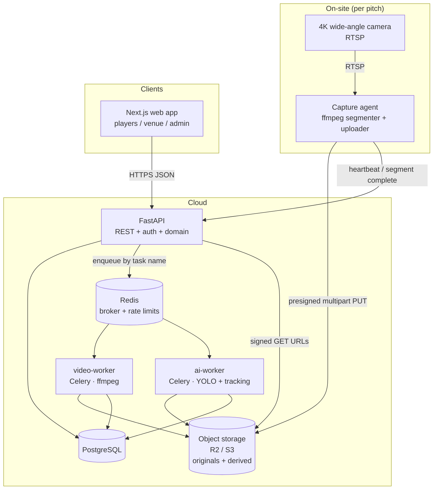
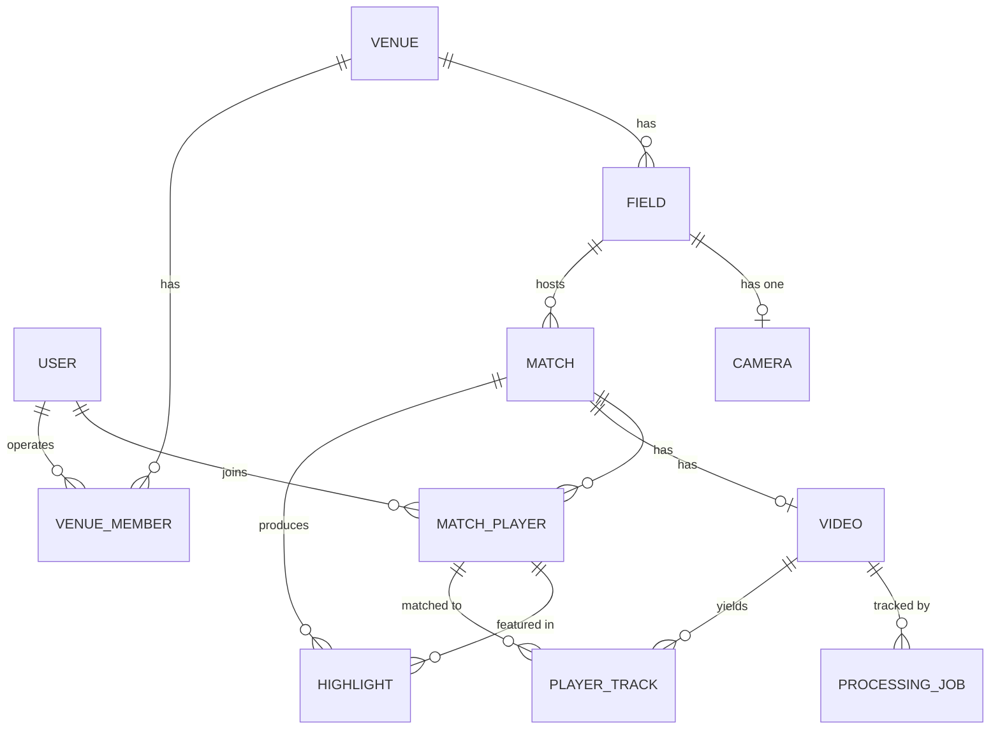
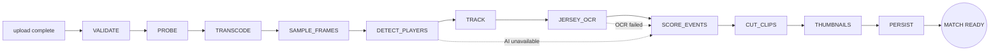

# Matchly — Architecture

AI-powered football recording and highlights platform for small pitches in Morocco.

**Status:** MVP design + Phase 1 implementation.
**Target deployment:** 1–5 pitches, ~5–50 matches/day, single region.
**Non-goal:** millions of users. Every decision below optimises for *getting one real
match recorded, processed and delivered end to end*, while leaving a clean upgrade path
to hundreds of pitches.

---

## Table of contents

1. [Product journey](#1-product-journey)
2. [System architecture](#2-system-architecture)
3. [Repository tree](#3-repository-tree)
4. [Data model](#4-data-model)
5. [PostgreSQL schema](#5-postgresql-schema)
6. [API contracts](#6-api-contracts)
7. [Asynchronous video-processing workflow](#7-asynchronous-video-processing-workflow)
8. [Highlight detection](#8-highlight-detection)
9. [Jersey number recognition](#9-jersey-number-recognition)
10. [Privacy & data retention](#10-privacy--data-retention)
11. [The 10 biggest technical risks](#11-the-10-biggest-technical-risks)
12. [What stays deliberately simple in the MVP](#12-what-stays-deliberately-simple-in-the-mvp)
13. [Phase 1 implementation checklist](#13-phase-1-implementation-checklist)

---

## 1. Product journey

```
Venue operator creates match          Players scan QR              Camera records
        │                                   │                            │
        ▼                                   ▼                            ▼
   SCHEDULED ──────────────────────────► CHECK_IN ──────────────────► RECORDING
                                   (team + jersey number)                │
                                                                         ▼
   READY ◄─── PROCESSING ◄─── UPLOADING ◄────────────────────── operator stops match
     │
     ▼
Players watch + share personal highlights (16:9 and 9:16)
```

The MVP validates that chain. Everything else is scaffolding for it.

---

## 2. System architecture

### 2.1 Topology



### 2.2 Processes

Five long-running processes, one shared Python library. **Not** microservices — one
deployable codebase, several entrypoints.

| Process | Runs | Responsibility |
|---|---|---|
| `api` | FastAPI / uvicorn | REST, auth, permissions, domain writes. Never touches video bytes. |
| `video-worker` | Celery, queue `video` | ffprobe, transcode, frame sampling, clip cutting, thumbnails. CPU + disk heavy. |
| `ai-worker` | Celery, queue `ai` | Detection, tracking, jersey OCR, highlight scoring. GPU-optional. |
| `beat` | Celery beat | Retention purge, stale-camera sweep, stuck-job reaper. |
| `web` | Next.js | Player app, venue dashboard, admin dashboard. |

Two worker queues, not one, because they have different resource profiles and different
failure modes: an ai-worker OOM must never block clip generation for a match whose
highlights were already scored. Both queues are served by the same image in dev; in
production `ai` can move to a GPU node without any code change.

### 2.3 Layering

```
apps/api          HTTP concerns only: routing, request/response schemas, permissions
  └─ services/    domain logic (match lifecycle, check-in rules, highlight assembly)
       └─ packages/shared
            ├─ domain/     SQLAlchemy models + enums   (single source of schema truth)
            ├─ storage/    ObjectStorage protocol → local | S3 | R2
            ├─ otp/        OtpProvider protocol → mock | Twilio | local SMS gateway
            └─ jobs/       Celery app + task-name constants (no task bodies)
services/*-worker  pipeline step implementations
```

Why the models live in `packages/shared` and not in `apps/api`: the workers must
persist results (video metadata, tracks, highlights, job state). The two realistic
options are (a) workers call the API over HTTP with an internal token, or (b) workers
import the same ORM models. For 1–5 pitches, (b) is dramatically simpler and removes an
entire class of "worker can't reach API" failures. The API remains the **only** writer of
migrations, so schema ownership stays singular.

The API imports `matchly_shared.jobs` only to *enqueue by task name* (`send_task`). It
never imports worker code, so the API image does not need ffmpeg, OpenCV, or torch.

### 2.4 Key architectural decisions

| Decision | Rationale | Upgrade path |
|---|---|---|
| One FastAPI app, modular routers | 1–5 pitches does not justify service boundaries | Extract a router into its own service when a team owns it |
| Celery + Redis (not SQS/Temporal) | Zero extra vendor, good enough semantics, trivial local dev | Swap broker URL; task contracts are name-based |
| Presigned direct upload | A 60-min 4K file is 8–30 GB; it must never pass through the API process | Already the scalable pattern |
| Storage keys, not URLs, in the DB | Vendor-neutral; URLs are signed at read time and expire | Change one env var to move R2 ↔ S3 |
| Originals and derived clips in **separate buckets** | Different lifecycle, different access, different cost class | Independent retention policies |
| Proxy video for CV, never the 4K master | 4K@30fps YOLO is ~100× too slow and unnecessary | Raise proxy resolution when GPUs arrive |
| Per-step job rows, idempotent tasks | Every step independently retryable, as required | Same rows feed the admin dashboard |
| Phone + OTP auth with provider interface | Morocco: phone is the identity; SMS vendor will change | Implement `OtpProvider` for the chosen vendor |

### 2.5 The capture agent contract (on-site)

The single most important reliability rule: **a match recording must never be lost.**
So recording is *not* a single 60-minute stream to the cloud.

1. Agent pulls RTSP from the fixed camera and writes **10-minute segments** to local disk
   (`ffmpeg -f segment`). Local disk is the durability buffer.
2. Each completed segment is uploaded via presigned multipart PUT, with retry and resume.
3. Segment upload confirmations go to the API; the `Video` row is only marked complete
   when every expected segment is present.
4. Segments are deleted from local disk only after the API confirms receipt.
5. If the network is down for the whole match, the segments still exist on site and
   upload when connectivity returns. The match sits in `UPLOADING`, not `FAILED`.

The agent itself is out of scope for Phase 1; the API-side contract (`/cameras/{id}/heartbeat`,
presigned upload endpoints, segment completion) is designed for it now so the agent can be
built against a stable interface.

---

## 3. Repository tree

```
matchly/
├── ARCHITECTURE.md
├── README.md
├── Makefile                          # make up / migrate / seed / test / lint
├── docker-compose.yml
├── .env.example                      # every variable, no secrets
│
├── apps/
│   ├── api/                          # FastAPI application
│   │   ├── app/
│   │   │   ├── main.py               # app factory, middleware, lifespan
│   │   │   ├── api/
│   │   │   │   ├── deps.py           # auth/session/pagination dependencies
│   │   │   │   ├── errors.py         # error envelope + handlers
│   │   │   │   └── v1/
│   │   │   │       ├── router.py     # aggregates all v1 routers
│   │   │   │       ├── auth.py       venues.py   cameras.py
│   │   │   │       ├── users.py      matches.py  videos.py
│   │   │   │       └── highlights.py admin.py
│   │   │   ├── core/                 # config, logging, security, pagination
│   │   │   ├── db/                   # session factory, unit of work
│   │   │   ├── schemas/              # Pydantic request/response models
│   │   │   ├── services/             # domain logic (no HTTP types)
│   │   │   └── seed.py               # development seed scenario
│   │   ├── alembic/                  # migrations (sole schema owner)
│   │   ├── tests/{unit,integration}/
│   │   ├── pyproject.toml
│   │   └── Dockerfile
│   │
│   └── web/                          # Next.js 15 · TS · Tailwind, mobile-first
│       ├── src/
│       │   ├── app/                  # App Router
│       │   │   ├── (player)/         # login, home, match, highlight viewer
│       │   │   ├── venue/            # venue operator dashboard
│       │   │   └── admin/            # platform admin dashboard
│       │   ├── components/           # reusable UI
│       │   └── lib/                  # api client, auth, formatting
│       └── Dockerfile
│
├── packages/
│   └── shared/                       # matchly_shared — imported by api + workers
│       └── matchly_shared/
│           ├── config.py             # env-driven settings
│           ├── logging.py            # structured JSON logging
│           ├── domain/               # enums.py, models.py, types.py
│           ├── storage/              # base.py, local.py, s3.py, factory.py
│           ├── otp/                  # base.py, mock.py, factory.py
│           └── jobs/                 # celery_app.py, task_names.py
│
├── services/
│   ├── video-worker/                 # ffprobe, transcode, sample, clip, thumbnail
│   └── ai-worker/                    # detect, track, jersey OCR, scoring
│
├── infra/
│   ├── docker/                       # per-image Dockerfiles + entrypoints
│   └── scripts/                      # bootstrap, wait-for, storage init
│
└── docs/                             # api.md, pipeline.md, runbook.md, privacy.md
```

---

## 4. Data model

### 4.1 Entities



### 4.2 Reconciliation notes

The agreed model is implemented as given, with three points resolved:

1. **`Field.camera_id` vs `Camera.field_id`** — a mutual FK needs deferred constraints and
   makes both sides nullable-and-writable, which drifts. The stored edge is
   **`cameras.field_id`** (unique — one camera per field in the MVP); `Field.camera` is
   exposed as a relationship and serialised as `camera` / `camera_id` in API responses.
   Reads look exactly as specified; writes have one owner.

2. **`Match.video_url` vs `Video.original_url` / `Video.processed_url`** — `videos` is the
   source of truth. `match.video_url` is a **derived, read-only** API field
   (`processed_url` when processing succeeded, else `original_url`, else `null`). No dual write,
   no drift.

3. **`*_url` columns store storage URIs, not public links.** A column holds
   `s3://matchly-originals/2026/…/master.mp4`; the API converts it to a short-lived signed
   HTTPS URL at read time. This is what keeps the platform vendor-neutral and keeps private
   match video private.

Fields the sketch omits but the product flow requires are kept: `matches.join_code` (the QR
journey is built on it), `fields.name` and `cameras.name` (venue staff need a human label —
"Pitch 1"), and `created_at` timestamps.

---

## 5. PostgreSQL schema

Conventions: `uuid` primary keys (v4, generated app-side so workers can build object keys
before insert), `timestamptz` everywhere, UTC, enums as native Postgres types, soft delete
only where privacy requires it.

### 5.1 Enums

```sql
CREATE TYPE user_role        AS ENUM ('PLAYER','VENUE_OPERATOR','ADMIN');
CREATE TYPE venue_role       AS ENUM ('OPERATOR','MANAGER');
CREATE TYPE camera_status    AS ENUM ('ONLINE','OFFLINE','RECORDING','ERROR');
CREATE TYPE match_status     AS ENUM ('SCHEDULED','CHECK_IN','RECORDING','UPLOADING','PROCESSING','READY','FAILED');
CREATE TYPE team             AS ENUM ('A','B');
CREATE TYPE video_status     AS ENUM ('PENDING','UPLOADING','UPLOADED','PROCESSING','READY','FAILED');
CREATE TYPE job_step         AS ENUM ('VALIDATE','PROBE','TRANSCODE','SAMPLE_FRAMES','DETECT_PLAYERS',
                                      'TRACK','JERSEY_OCR','SCORE_EVENTS','CUT_CLIPS','THUMBNAILS','PERSIST');
CREATE TYPE job_status       AS ENUM ('PENDING','RUNNING','SUCCEEDED','FAILED','SKIPPED');
CREATE TYPE highlight_type   AS ENUM ('GOAL_AREA_ACTION','HIGH_INTENSITY','CELEBRATION','TEAM_BUILDUP','GENERIC');
```

### 5.2 Tables

```sql
-- ── Identity ──────────────────────────────────────────────────────────────
CREATE TABLE users (
    id          uuid PRIMARY KEY,
    name        varchar(120)  NOT NULL,
    phone       varchar(20)   NOT NULL,          -- E.164, e.g. +212612345678
    avatar      text,
    role        user_role     NOT NULL DEFAULT 'PLAYER',
    created_at  timestamptz   NOT NULL DEFAULT now(),
    updated_at  timestamptz   NOT NULL DEFAULT now(),
    deleted_at  timestamptz                       -- account deletion (privacy)
);
CREATE UNIQUE INDEX users_phone_key ON users (phone) WHERE deleted_at IS NULL;

CREATE TABLE otp_challenges (
    id          uuid PRIMARY KEY,
    phone       varchar(20)  NOT NULL,
    code_hash   varchar(255) NOT NULL,            -- never store the code itself
    expires_at  timestamptz  NOT NULL,
    attempts    int          NOT NULL DEFAULT 0,
    consumed_at timestamptz,
    created_at  timestamptz  NOT NULL DEFAULT now()
);
CREATE INDEX otp_challenges_phone_idx ON otp_challenges (phone, created_at DESC);

CREATE TABLE refresh_tokens (
    id          uuid PRIMARY KEY,
    user_id     uuid NOT NULL REFERENCES users(id) ON DELETE CASCADE,
    token_hash  varchar(255) NOT NULL UNIQUE,
    expires_at  timestamptz  NOT NULL,
    revoked_at  timestamptz,
    created_at  timestamptz  NOT NULL DEFAULT now()
);

-- ── Venue graph ───────────────────────────────────────────────────────────
CREATE TABLE venues (
    id                     uuid PRIMARY KEY,
    name                   varchar(160) NOT NULL,
    location               varchar(255) NOT NULL,
    timezone               varchar(64)  NOT NULL DEFAULT 'Africa/Casablanca',
    video_retention_days   int          NOT NULL DEFAULT 90,   -- configurable retention
    recording_disclosure   text,                               -- shown at check-in
    created_at             timestamptz  NOT NULL DEFAULT now()
);

CREATE TABLE venue_members (            -- venue-level access control
    id         uuid PRIMARY KEY,
    venue_id   uuid NOT NULL REFERENCES venues(id) ON DELETE CASCADE,
    user_id    uuid NOT NULL REFERENCES users(id)  ON DELETE CASCADE,
    role       venue_role NOT NULL DEFAULT 'OPERATOR',
    created_at timestamptz NOT NULL DEFAULT now(),
    UNIQUE (venue_id, user_id)
);

CREATE TABLE fields (
    id         uuid PRIMARY KEY,
    venue_id   uuid NOT NULL REFERENCES venues(id) ON DELETE CASCADE,
    name       varchar(120) NOT NULL,
    created_at timestamptz  NOT NULL DEFAULT now(),
    UNIQUE (venue_id, name)
);

CREATE TABLE cameras (
    id         uuid PRIMARY KEY,
    field_id   uuid NOT NULL UNIQUE REFERENCES fields(id) ON DELETE CASCADE,
    name       varchar(120)  NOT NULL,
    status     camera_status NOT NULL DEFAULT 'OFFLINE',
    stream_url text,                       -- RTSP; read by the capture agent only
    last_seen  timestamptz,
    created_at timestamptz   NOT NULL DEFAULT now()
);

-- ── Match ─────────────────────────────────────────────────────────────────
CREATE TABLE matches (
    id          uuid PRIMARY KEY,
    field_id    uuid NOT NULL REFERENCES fields(id) ON DELETE RESTRICT,
    starts_at   timestamptz  NOT NULL,
    ends_at     timestamptz  NOT NULL,
    status      match_status NOT NULL DEFAULT 'SCHEDULED',
    join_code   varchar(12)  NOT NULL UNIQUE,     -- QR target: /match/join/{join_code}
    title       varchar(160),
    created_by  uuid REFERENCES users(id) ON DELETE SET NULL,
    started_at  timestamptz,                      -- actual, set by Start Match
    stopped_at  timestamptz,                      -- actual, set by Stop Match
    failure_reason text,
    created_at  timestamptz NOT NULL DEFAULT now(),
    updated_at  timestamptz NOT NULL DEFAULT now(),
    CHECK (ends_at > starts_at)
);
CREATE INDEX matches_field_starts_idx  ON matches (field_id, starts_at DESC);
CREATE INDEX matches_status_idx        ON matches (status, starts_at DESC);

CREATE TABLE match_players (
    id             uuid PRIMARY KEY,
    match_id       uuid NOT NULL REFERENCES matches(id) ON DELETE CASCADE,
    user_id        uuid NOT NULL REFERENCES users(id)   ON DELETE CASCADE,
    team           team NOT NULL,
    jersey_number  int  NOT NULL CHECK (jersey_number BETWEEN 0 AND 99),
    consent_at     timestamptz,                   -- participation consent
    created_at     timestamptz NOT NULL DEFAULT now(),
    UNIQUE (match_id, user_id)
);
-- Duplicate jersey numbers blocked per team; an admin override drops the row's
-- participation in this partial index by setting jersey_override = true.
ALTER TABLE match_players ADD COLUMN jersey_override boolean NOT NULL DEFAULT false;
CREATE UNIQUE INDEX match_players_jersey_key
    ON match_players (match_id, team, jersey_number)
    WHERE jersey_override = false;

-- ── Video & processing ────────────────────────────────────────────────────
CREATE TABLE videos (
    id            uuid PRIMARY KEY,
    match_id      uuid NOT NULL UNIQUE REFERENCES matches(id) ON DELETE CASCADE,
    original_url  text,                    -- storage URI of the master recording
    processed_url text,                    -- storage URI of the web-playable replay
    proxy_url     text,                    -- storage URI of the low-res CV proxy
    duration      double precision,        -- seconds, from ffprobe
    status        video_status NOT NULL DEFAULT 'PENDING',
    size_bytes    bigint,
    width         int,
    height        int,
    fps           double precision,
    has_audio     boolean NOT NULL DEFAULT false,
    metadata      jsonb   NOT NULL DEFAULT '{}'::jsonb,   -- raw ffprobe output
    failure_reason text,
    purge_after   timestamptz,             -- retention deadline for the original
    created_at    timestamptz NOT NULL DEFAULT now(),
    updated_at    timestamptz NOT NULL DEFAULT now()
);

CREATE TABLE processing_jobs (
    id           uuid PRIMARY KEY,
    video_id     uuid NOT NULL REFERENCES videos(id) ON DELETE CASCADE,
    step         job_step   NOT NULL,
    status       job_status NOT NULL DEFAULT 'PENDING',
    attempts     int        NOT NULL DEFAULT 0,
    max_attempts int        NOT NULL DEFAULT 3,
    fingerprint  varchar(64),              -- input hash → idempotency / skip-if-done
    result       jsonb NOT NULL DEFAULT '{}'::jsonb,
    last_error   text,
    started_at   timestamptz,
    finished_at  timestamptz,
    created_at   timestamptz NOT NULL DEFAULT now(),
    updated_at   timestamptz NOT NULL DEFAULT now(),
    UNIQUE (video_id, step)                -- one row per step per video: idempotent
);
CREATE INDEX processing_jobs_status_idx ON processing_jobs (status, updated_at DESC);

-- ── AI output ─────────────────────────────────────────────────────────────
CREATE TABLE player_tracks (               -- populated from Phase 5
    id                uuid PRIMARY KEY,
    video_id          uuid NOT NULL REFERENCES videos(id) ON DELETE CASCADE,
    track_ref         varchar(64) NOT NULL,          -- tracker-assigned id
    jersey_number     int,
    jersey_confidence double precision,
    player_id         uuid REFERENCES match_players(id) ON DELETE SET NULL,
    first_seen        double precision NOT NULL,     -- seconds
    last_seen         double precision NOT NULL,
    samples           jsonb NOT NULL DEFAULT '[]'::jsonb,  -- per-frame votes (audit)
    created_at        timestamptz NOT NULL DEFAULT now(),
    UNIQUE (video_id, track_ref)
);

CREATE TABLE highlights (
    id            uuid PRIMARY KEY,
    match_id      uuid NOT NULL REFERENCES matches(id) ON DELETE CASCADE,
    video_id      uuid REFERENCES videos(id) ON DELETE CASCADE,
    player_id     uuid REFERENCES match_players(id) ON DELETE SET NULL,  -- optional
    start_time    double precision NOT NULL,       -- seconds into the match video
    end_time      double precision NOT NULL,
    score         double precision NOT NULL,       -- 0..1 confidence
    type          highlight_type NOT NULL DEFAULT 'GENERIC',
    video_url     text,                            -- storage URI, 16:9 clip
    video_url_vertical text,                       -- storage URI, 9:16 clip (optional)
    thumbnail_url text,
    signals       jsonb NOT NULL DEFAULT '{}'::jsonb,   -- {"motion":0.94,"player_density":0.88}
    created_at    timestamptz NOT NULL DEFAULT now(),
    CHECK (end_time > start_time)
);
CREATE INDEX highlights_match_score_idx  ON highlights (match_id, score DESC);
CREATE INDEX highlights_player_idx       ON highlights (player_id, created_at DESC);
```

### 5.3 Query shapes that drove the indexes

| Screen | Query |
|---|---|
| Player home | `match_players` by `user_id` → matches by `starts_at` |
| Match page | matches by id + players + highlights ordered by `score DESC` |
| My highlights | `highlights` join `match_players` on `player_id` where `user_id = me` |
| Venue dashboard | matches by `field_id` in venue, `starts_at` today |
| Admin failed jobs | `processing_jobs` where `status='FAILED'` order by `updated_at DESC` |

---

## 6. API contracts

Base path `/api/v1`. JSON only. Bearer JWT. OpenAPI served at `/docs`.

### 6.1 Conventions

**Error envelope** — every 4xx/5xx:

```json
{ "error": { "code": "JERSEY_TAKEN",
             "message": "Jersey number 7 is already taken on team A.",
             "details": {"team": "A", "jersey_number": 7},
             "request_id": "01JD2P…" } }
```

`code` is a stable machine string; `message` is human text; the frontend switches on `code`.

**Pagination** — `?page=1&page_size=20` (max 100):

```json
{ "items": [], "page": 1, "page_size": 20, "total": 137, "has_next": true }
```

**Roles** — `PLAYER` (default), `VENUE_OPERATOR` (scoped by `venue_members`), `ADMIN`.
Every venue-scoped route checks membership, not just the role bit.

**Idempotency** — `POST /matches/{id}/start|stop|process` are idempotent: repeating a call
in the target state returns `200` with the current resource, never a `409`.

### 6.2 Auth

| Method | Path | Auth | Body → Response |
|---|---|---|---|
| POST | `/auth/request-otp` | public | `{phone}` → `{challenge_id, expires_at, dev_code?}` |
| POST | `/auth/verify-otp` | public | `{phone, code, name?}` → `{access_token, refresh_token, expires_in, user}` |
| POST | `/auth/refresh` | public | `{refresh_token}` → new token pair (rotating) |
| POST | `/auth/logout` | bearer | `{refresh_token}` → `204` |

`dev_code` is returned **only** when `OTP_PROVIDER=mock`, so local development never needs
a real SMS. Rate limits: 3 OTP requests / phone / 10 min, 5 verify attempts / challenge.

### 6.3 Users

| Method | Path | Notes |
|---|---|---|
| GET | `/users/me` | current profile |
| PATCH | `/users/me` | `{name?, avatar?}` |
| DELETE | `/users/me` | account deletion — soft-deletes, anonymises, schedules purge |
| GET | `/users/me/matches` | `?scope=upcoming\|past` paginated |
| GET | `/users/me/highlights` | personal highlights across matches, newest first |

### 6.4 Matches

| Method | Path | Auth | Notes |
|---|---|---|---|
| GET | `/matches` | bearer | Scoped by entitlement (see below); filters `venue_id, field_id, status, from, to` narrow within it |
| POST | `/matches` | operator | `{field_id, starts_at, ends_at, title?}` → generates `join_code` |
| GET | `/matches/{id}` | bearer | venue, field, teams, players, status, `video_url`, counts |
| GET | `/matches/join/{join_code}` | public | check-in preview: venue, field, time, taken jerseys, disclosure |
| POST | `/matches/{id}/join` | bearer | `{team, jersey_number, consent}` → `MatchPlayer` |
| DELETE | `/matches/{id}/players/me` | bearer | leave before recording starts |
| POST | `/matches/{id}/start` | operator | `SCHEDULED\|CHECK_IN → RECORDING`, signals camera |
| POST | `/matches/{id}/stop` | operator | `RECORDING → UPLOADING` |
| POST | `/matches/{id}/video` | operator/agent | register upload → presigned target or completion |
| POST | `/matches/{id}/process` | operator | enqueue pipeline; `?force=true` re-runs completed steps |
| GET | `/matches/{id}/highlights` | bearer | `?player_id=` for personal cut |
| DELETE | `/matches/{id}` | operator | match deletion incl. stored video (privacy) |

`POST /matches/{id}/join` failure codes: `JERSEY_TAKEN`, `MATCH_NOT_JOINABLE`,
`CONSENT_REQUIRED`, `ALREADY_JOINED`.

**Match visibility.** A roster records who played football where and when, so
`GET /matches` returns what the caller is entitled to see rather than whatever the
filters ask for: admins see every match, venue staff see their venues', players
see the matches they joined. A filter naming someone else's venue returns an empty
page — not a 403, which would confirm the venue exists.

**Jersey uniqueness is enforced twice.** The service pre-checks so the player gets
a clear message, and the partial unique index catches the race when two players
tap `#7` in the same second. The `IntegrityError` is translated back into the same
`JERSEY_TAKEN` the pre-check would have produced, inside a savepoint so the
transaction survives. `jersey_override` lifts a row out of that index, which is
how the administrator override works.

### 6.5 Venues, fields, cameras

| Method | Path | Notes |
|---|---|---|
| GET | `/venues` / `POST /venues` | admin creates; operators list their own |
| GET | `/venues/{id}` | venue detail with fields + camera status |
| GET | `/venues/{id}/matches` | `?date=` — the venue dashboard's main query |
| GET/POST | `/venues/{id}/fields` | field management |
| POST | `/fields/{id}/camera` | attach/replace the camera on a field |
| GET | `/cameras/{id}/status` | `{status, last_seen, online, current_match_id}` |
| POST | `/cameras/{id}/heartbeat` | `X-Camera-Token`; updates `status` + `last_seen` |

`online` is derived, not stored: `last_seen > now() - CAMERA_OFFLINE_AFTER_SECONDS`.
An agent that dies without saying goodbye leaves `status = ONLINE` behind, so the
column alone would tell a venue everything was fine until after the match.

**Camera credentials.** Attaching a camera returns a token once; only its hash is
stored. The capture agent is a machine, so it presents that token in
`X-Camera-Token` rather than holding a user session. Re-attaching rotates it.

### 6.6 Admin

| Method | Path | Notes |
|---|---|---|
| GET | `/admin/overview` | counts: venues, fields, cameras, matches, users |
| GET | `/admin/jobs` | `?status=FAILED&step=` — processing job inspector |
| POST | `/admin/jobs/{id}/retry` | re-enqueue one step |
| GET | `/admin/storage` | bytes by bucket class + per-venue breakdown |

---

## 7. Asynchronous video-processing workflow

### 7.1 Pipeline



| Step | Worker | Does | Fallback if it fails |
|---|---|---|---|
| `VALIDATE` | video | object exists, size sane, readable header | **hard fail** — nothing else is possible |
| `PROBE` | video | ffprobe → duration, fps, resolution, audio | hard fail |
| `TRANSCODE` | video | master → 1080p H.264 replay + 640p CV proxy | hard fail (replay is the core deliverable) |
| `SAMPLE_FRAMES` | video | 2 fps frames from the proxy | skip → generic highlights |
| `DETECT_PLAYERS` | ai | YOLO person boxes per sampled frame | skip → motion-only scoring |
| `TRACK` | ai | ByteTrack over detections | skip → no per-player attribution |
| `JERSEY_OCR` | ai | crop → jersey region → OCR → temporal vote | skip → unattributed highlights |
| `SCORE_EVENTS` | ai | signals → candidates → NMS → top 10–20 | hard fail (no highlights = no product) |
| `CUT_CLIPS` | video | ffmpeg clip per highlight, 16:9 (+9:16) | partial: keep the clips that worked |
| `THUMBNAILS` | video | one JPEG per clip | skip → frontend uses a poster frame |
| `PERSIST` | video | write highlights, set `MATCH_READY` | hard fail |

**Critical property:** everything from `SAMPLE_FRAMES` to `JERSEY_OCR` is *skippable*. If the
ai-worker is down, OOMs, or the model file is missing, the match still reaches `READY` with
motion-based highlights and a full replay. The AI is an enhancement, never a dependency.

### 7.2 Orchestration and idempotency

A coordinator task walks an ordered step list. For each step:

```python
job = get_or_create_job(video_id, step)          # UNIQUE(video_id, step)
if job.status == SUCCEEDED and job.fingerprint == current_fingerprint and not force:
    continue                                      # idempotent: already done
run(step)                                         # updates attempts / timings / result
```

* **Idempotent** — re-running the pipeline re-uses completed steps. Retry after a crash
  resumes at the failed step, not from the top; a 60-minute transcode is never redone
  because jersey OCR failed.
* **Fingerprint** — hash of the step's inputs (source key, relevant settings). If the input
  changed, the step re-runs even though it previously succeeded.
* **Deterministic object keys** — `{video_id}/clips/{highlight_id}.mp4`, so a retried step
  overwrites rather than duplicating.
* **Retry** — Celery `autoretry_for` with exponential backoff, `max_attempts` from the job
  row. Exhausted retries mark the step `FAILED` with `last_error`; skippable steps then let
  the pipeline continue.
* **Reaper** — a beat task moves jobs stuck in `RUNNING` past a timeout back to `PENDING`
  (worker died mid-step).
* **Originals are never mutated.** `matchly-originals` is write-once; every derived artefact
  lands in `matchly-derived`. A pipeline bug can therefore never destroy a recording.
  The one write into the originals bucket is the joined master, under a
  deterministic key, so a retry overwrites its own output rather than duplicating it.

Implemented in `packages/shared/matchly_shared/pipeline/` (the contract and the
state machine) and `services/video-worker/video_worker/steps/` (the ffmpeg work).
The API can read job state without importing ffmpeg or any CV dependency.

### 7.3 Compute budget (why proxies matter)

A 60-minute 4K master is ~8–30 GB. Running YOLO on every 4K frame is ~108,000 frames.
The MVP instead samples **2 fps from a 640p proxy** → ~7,200 small frames, which is minutes
of CPU, not hours, and fits a single modest box serving 5 pitches. Detection quality on
7-a-side pitches at 640p is adequate for *density and motion* signals, which is all the
heuristic scorer needs.

---

## 8. Highlight detection

`HighlightDetector` is a protocol with two implementations:

* `MockHighlightDetector` (Phase 4) — deterministic pseudo-random candidates. Lets the whole
  end-to-end flow ship and the frontend be built before any CV exists.
* `HeuristicHighlightDetector` (Phase 5) — weighted signal fusion.

Signals are individually registered and individually optional; each returns a 0–1 series
over time:

| Signal | Source | Weight (initial) |
|---|---|---|
| `motion` | frame-difference energy on the proxy | 0.30 |
| `acceleration` | derivative of track velocities | 0.20 |
| `player_density` | detections inside goal-area polygons | 0.25 |
| `direction_change` | aggregate heading change | 0.10 |
| `audio_peak` | RMS peaks vs. rolling baseline | 0.10 |
| `clustering` | celebration = players converging | 0.05 |

```json
{ "timestamp": 865, "score": 0.91,
  "signals": { "motion": 0.94, "player_density": 0.88, "audio_peak": 0.76 } }
```

Candidate → clip: `start_time = t - 8s`, `end_time = t + 10s`, clamped to the video.
Overlaps are removed with temporal non-maximum suppression (drop any candidate overlapping a
higher-scored one by more than 50%), then the top 10–20 by score are kept.

Weights live in configuration, not code. Replacing the whole thing later with a trained
football-event model means implementing one protocol method — the pipeline, storage, clip
cutting and API do not change.

---

## 9. Jersey number recognition

```
detection box → player crop → torso/jersey region → OCR/classifier → temporal vote
```

A single frame is never trusted. Votes are accumulated per track and combined with
confidence weighting:

```
frame 1020 → #7  conf .62
frame 1030 → #7  conf .81
frame 1040 → #1  conf .32     ← outlier, outvoted
frame 1050 → #7  conf .78
──────────────────────────────
final: #7, confidence 0.82
```

`confidence = Σ(conf for winner) / Σ(conf all votes)`, requiring a minimum vote count and a
minimum margin over the runner-up. Below threshold the track stays unattributed.

Attribution to `MatchPlayer` is a constrained assignment: a track's voted number is matched
against `(team, jersey_number)` from check-in. Since check-in gives us the *expected* set of
numbers per team, OCR only has to pick among ~12 known candidates rather than all of 0–99 —
much easier, and wrong reads that don't correspond to any registered player are discarded.

If recognition fails entirely, highlights are stored with `player_id = NULL` and surface as
general match highlights. The product still works.

---

## 10. Privacy & data retention

No facial recognition, ever. Attribution is by jersey number and check-in registration only.

| Requirement | Implementation |
|---|---|
| Participation consent | `match_players.consent_at`; check-in cannot complete without it |
| Recording disclosure | `venues.recording_disclosure` shown on the join screen and at the pitch |
| Configurable retention | `venues.video_retention_days` → `videos.purge_after`; beat task deletes originals past the deadline |
| Account deletion | `DELETE /users/me` → anonymise, detach from `match_players`, revoke tokens, purge avatar |
| Match deletion | `DELETE /matches/{id}` → cascade rows + delete every object under both bucket prefixes |
| Venue-level access | `venue_members` gates every venue-scoped route |
| Access to video | Private buckets, short-lived signed URLs only; no public objects |

Retention defaults: originals 90 days (configurable per venue), generated clips kept
longer since they are small and are what players actually return for.

---

## 11. The 10 biggest technical risks

| # | Risk | Impact | Mitigation |
|---|---|---|---|
| 1 | **Losing a recording** — network drop, disk full, agent crash | Fatal to trust; unrepeatable event | Segmented local recording as durability buffer; resumable multipart upload; segments deleted only after server confirmation; `UPLOADING` is a resumable state, not a failure |
| 2 | **Upload bandwidth in Morocco** — 8–30 GB per match on a pitch's ADSL/4G | Match not ready for hours | Record H.264 at a sane bitrate, not raw; upload 10-min segments during the match, not after; consider on-site proxy generation so CV can start before the master finishes |
| 3 | **CV cost/latency** — naive 4K YOLO is 100× the budget | Pipeline can't keep up with 5 pitches | 640p proxy at 2 fps; batch inference; ai steps skippable; queue separation so video work is never blocked |
| 4 | **Jersey OCR accuracy** — small, blurred, rotated, occluded numbers on a wide 4K shot | Wrong player attribution is worse than none | Temporal voting with margin + minimum-votes thresholds; constrained matching against registered numbers; confidence surfaced in the UI; unattributed fallback |
| 5 | **Highlight quality** — heuristics fire on kick-offs and crowd noise, miss real goals | Players don't share → no growth | Ship the mock detector first to validate delivery; tune weights on real recordings; capture per-highlight feedback from day one to build a labelled set for a future model |
| 6 | **Storage cost growth** — 5 pitches × 10 matches × 15 GB ≈ 750 GB/day | Unsustainable bill | Separate bucket classes; retention purge; R2 (zero egress) as default; clips kept, masters expired |
| 7 | **Camera reliability** — offline, wrong exposure, moved, RTSP drops | Silent failure discovered after the match | Heartbeat + `last_seen`; venue dashboard shows online/offline before kick-off; recording start verifies the stream; alert if a `RECORDING` match has no segments after N minutes |
| 8 | **Long-running work in the wrong place** | API timeouts, lost work | Hard rule: no video work in request handlers; API only enqueues; all state in `processing_jobs` |
| 9 | **Duplicate/incorrect check-in data** — two players claim #7, players never check in | Attribution impossible | DB-level partial unique index with explicit admin override; join screen shows taken numbers; matches process fine with zero registered players |
| 10 | **Privacy/legal exposure** — minors, bystanders, video sharing | Regulatory and reputational | Consent at check-in, visible disclosure, no facial recognition, private buckets with signed URLs, per-venue retention, documented deletion paths |

Two more worth naming: **ffmpeg/model version drift** (pinned in the image, never `latest`)
and **operator usability** — venue staff are not technical, so the dashboard is four large
buttons, not a control panel.

---

## 12. What stays deliberately simple in the MVP

| Area | MVP choice | Deferred |
|---|---|---|
| Highlight detection | Heuristic signal fusion | Trained football-event model |
| Ball tracking | Not attempted | Ball detection when the model justifies it |
| Tactical analysis | None (no passes, xG, formations) | Post-MVP analytics |
| Face/identity | Jersey + check-in only | Never: facial recognition is out of scope by design |
| Auth | Phone OTP + JWT, no passwords, no OAuth | Social login, org SSO |
| Payments | None | Booking and billing |
| Realtime | Polling for match status | WebSockets/SSE when polling hurts |
| Deployment | One box + docker compose; managed Postgres | Kubernetes, autoscaling, multi-region |
| Media delivery | Signed URLs to object storage | CDN, HLS/ABR ladder |
| Vertical clips | Centre crop 9:16 | Subject-tracking reframe |
| i18n | French/English strings, RTL-ready layout | Full Arabic localisation |
| Notifications | In-app + share links | WhatsApp Business API push |
| Search/analytics | Plain SQL | Warehouse, dashboards |

The rule: anything that is not *record → process → deliver* gets the smallest implementation
that is honest, behind an interface if a vendor is involved.

---

## 13. Phase 1 implementation checklist

**Goal:** the skeleton runs, the schema exists, a phone number can log in, and the frontend
can render seeded data — before any video or AI code is written.

### Repository & docs
- [x] Monorepo tree (`apps/`, `packages/`, `services/`, `infra/`, `docs/`)
- [x] `ARCHITECTURE.md` (this document)
- [x] `README.md` with a 3-command quickstart
- [x] `Makefile` — `up`, `down`, `migrate`, `seed`, `test`, `lint`
- [x] `.env.example` with every variable and no secrets

### Development environment
- [x] `docker-compose.yml`: postgres, redis, minio (+ bucket init), api, video-worker, ai-worker, web
- [x] Dockerfiles per service; ffmpeg only in the worker images
- [x] Health checks and dependency ordering
- [x] Hot reload for api and web

### Shared package (`matchly_shared`)
- [x] Env-driven settings
- [x] Structured JSON logging with request/job correlation ids
- [x] Enums + SQLAlchemy models for every table in §5
- [x] Portable UUID/JSON column types (Postgres in prod, SQLite for fast unit tests)
- [x] `ObjectStorage` protocol + `LocalStorage` + `S3CompatibleStorage` (S3 **and** R2)
- [x] `OtpProvider` protocol + `MockOtpProvider` + `LoggingOtpProvider`
- [x] Celery app factory with `video` / `ai` queues and task-name constants

### API
- [x] App factory, CORS, request-id middleware, error envelope, exception handlers
- [x] `GET /health` (liveness) and `GET /health/ready` (Postgres + Redis)
- [x] JWT access + rotating refresh tokens; role and venue-membership dependencies
- [x] `POST /auth/request-otp`, `POST /auth/verify-otp`, `POST /auth/refresh`, `POST /auth/logout`
- [x] `GET/PATCH /users/me`
- [x] Pagination helper and shared response envelope
- [x] Alembic initial migration covering the full §5 schema
- [x] Seed: Arena Demo Casablanca / Pitch 1 / Team A (Youssef 7, Hamza 10, Mehdi 4) vs
      Team B (Amine 9, Omar 5, Adam 11) + fake highlights

### Web
- [x] Next.js (App Router) + TypeScript + Tailwind, mobile-first
- [x] Typed API client with token storage and refresh
- [x] Login screen (phone → OTP), home shell, reusable UI primitives
- [x] Match status and highlight card components against seeded data

### Tests
- [x] Unit: JWT, OTP hashing/expiry/attempts, storage backends, pagination, config
- [x] Integration: request-otp → verify-otp → `/users/me`, health, migration up/down

**Phase 1 exit criteria:** `make up` boots everything; `make migrate seed` populates the demo
match; a phone number logs in end to end via the mock OTP provider; `make test` is green;
`/docs` lists the implemented endpoints.

**Phases 2, 3 and 4 are also complete.** The product now runs end to end: a
venue schedules a match, players check in by QR code, the recording uploads in
segments, a worker joins, probes, transcodes and cuts it, and players watch their
clips. Highlight detection is deliberately a placeholder — Phase 5 replaces
`MockHighlightDetector` with real computer vision behind the same interface.

Two things the implementation settled that are worth recording here:

* **Fingerprints cover inputs, never outputs.** `VALIDATE` joins segments and
  writes `original_url`; if that fed the fingerprint, every run would see changed
  inputs and re-join an hour of 4K forever. The identity is the upload manifest —
  the segments as they arrived — which is fixed once the upload completes.
* **Unimplemented steps stay `PENDING`, not `FAILED`.** That is what lets a match
  reach `READY` today with the CV steps unwritten, and what will let those steps
  move to a GPU node without touching the orchestration.

See `docs/roadmap.md` for the current state of each phase. Phases 5–7 proceed as
specified in the brief, each gated on the previous one being green.
